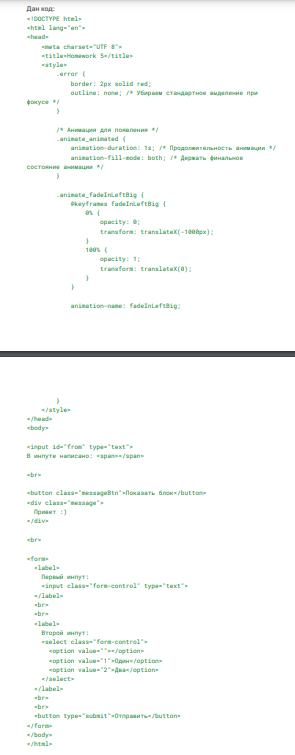

# Продолжение JavaScript #

# Урок 4. Семинар. Работа с событиями. #

В этом задании вам предстоит работать с различными событиями и манипуляциями
DOM. Все задачи выполняйте внутри тега script.

В инпуте написано:
Показать блок

Привет :)

Первый инпут:

Второй инпут: Один Два

**Задачи:**

1. При изменении значения в input с id="from", значение, содержащееся
в нем, должно моментально отображаться в span.

* Это значит, что при каждом изменении текста в инпуте, текст в span
должен обновляться соответственно.

2. При клике на кнопку с классом messageBtn необходимо выполнить
следующие действия для элемента с классом message:

* Добавить два класса: animate_animated и animate_fadeInLeftBig.
* Установить стиль visibility в значение 'visible'.

3. При отправке формы проверьте, заполнены ли все поля.

* Если какое-либо поле не заполнено, форма не должна отправляться.
* Незаполненные поля должны быть подсвечены (добавлен класс error).
* Как только пользователь начинает заполнять поле, выполните проверку:

■ Если поле пустое, подсветите его (добавьте класс error).

■ Если поле заполнено, уберите подсветку (удалите класс error).

